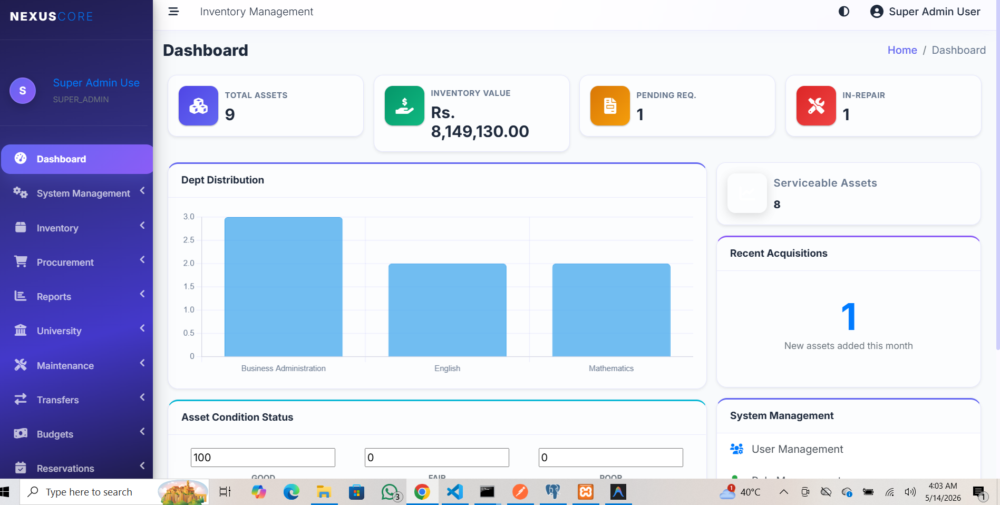

# University Inventory & Asset Management System (Innovation Edition)

An enterprise-grade, role-based University Inventory and Asset Management System built with PHP and MySQL. Designed to handle the complete lifecycle of university assets—from faculty procurement requests, through financial approvals, physical receipt, allocation, and final deadstock/scrap disposal. 

Features a modern, fluid "Glassmorphic" UI with a standardized dark-mode theme utilizing Vanilla CSS and Bootstrap 5.

## 🚀 Key Features

### 1. Robust Procurement Workflow
- **Indent Requests**: Faculty and HODs can formally request new equipment.
- **Purchase Orders (POs)**: Automated PO generation and vendor tracking from approved indents.
- **Goods Receipt Notes (GRN)**: Store officers record received shipments, logging item condition, and triggering automatic asset drafting into the active inventory.

### 2. Comprehensive Asset Lifecycle & Tracking
- **Smart Asset Tracking**: Items are tracked with auto-generated serials, tags, and QR Codes for physical scanning.
- **Asset Allocations & Reservations**: Users can check out, reserve, or return equipment.
- **Automated Maintenence & Deadstock**: Items can be flagged for repair ("In Repair") or condemned as scrap ("Deadstock") once deprecation is reached. The system handles secure approval hierarchies just for disposal.

### 3. Departmental & Budget Isolation 
- **Role-Based Workflows**: Strictly isolated views for Head of Departments (HOD) and Coordinators. An HOD only sees the active assets, staff, and budget parameters belonging to their specific department block.
- **Budget Management**: Dedicated financial ledgers allowing Super Admins to allocate yearly fiscal budgets to departments. Features manual expense/refund transaction logging that prevents budget overdraw. 

### 4. Advanced System Administration
- **Dynamic Permission Matrix**: Granular GUI matrix for the Super Admin to toggle specific page accesses (Read/Write) per user role in real-time.
- **Intelligent Dashboard Analytics**: Visual metric reports using Chart.js to map budget utilization, departmental distribution, and system-wide serviceability percentages. 

## 🛠 Tech Stack

- **Backend Logic**: PHP 8.x (Vanilla)
- **Database Architecture**: MySQL / MariaDB (using secure `PDO` abstraction)
- **Frontend / UI**: HTML5, Vanilla JavaScript, Bootstrap 5 (Customized overrides)
- **Styling Details**: Modern CSS including native CSS Variables for global state management, theming (`--nc-bg-card`, etc.), and CSS Glassmorphism.
- **Plugins**: Chart.js (Analytics), QRCode.js (Hardware Tagging), FontAwesome 5 (Iconography).

## 🗄️ Database Setup

1. Create a MySQL database (e.g. `inventory_db`).
2. Import your latest schema dump into the database.
3. Establish your DB connection by editing the `core/db.php` file using the established constants (configured in `core/config.php`):
   ```php
   define('DB_HOST', 'localhost');
   define('DB_NAME', 'inventory_db');
   define('DB_USER', 'root');
   define('DB_PASS', '');
   ```

## 🔒 Security Summary
- Extensive PDO prepared statement usage handling all dynamic SQL parameters to prevent SQLi.
- Native session handling and dynamic role verification integrated directly into the core `includes/header.php`.
- CSRF token logic and verification functions applied to critical data-mutating endpoints.

## 👥 User Roles Summary
- **Super Admin**: Absolute visibility and configuration control.
- **HOD (Head of Department)**: Manages indent requests, departmental budget, and specific staff allocations.
- **Coordinator**: Operational support assisting HOD workflows.
- **Staff/Default**: Basic view and reservation access for circulating hardware.

---
*Created as an end-to-end framework for seamless academic hardware organization.*
=======


## 🌟 Introduction
The **University Inventory & Asset Management System** is an enterprise-grade solution designed to streamline the lifecycle of university resources. From initial procurement requests by faculty to final disposal of deadstock, the system provides a transparent, role-based workflow. It features a modern **Glassmorphic UI**, dynamic access control, and real-time departmental isolation, ensuring that every asset—from a board marker to a high-end server—is tracked with precision.

---

## 📂 Project Structure
```text
University-Inventory-Mgt/
├── assets/                 # CSS, JS, and Image assets (AdminLTE base)
├── core/                   # Backend logic (DB connection, Session, Global Functions)
├── dashboards/             # Role-specific modules and page groups
│   ├── budget/             # Budget allocation and expenditure tracking
│   ├── disposal/           # Asset retirement and scrap management
│   ├── inventory/          # Asset registry and categorization
│   ├── locator/            # Physical location search and tracking
│   ├── maintenance/        # Transfers and repair requests
│   ├── procurement/        # Indents, POs, and GRNs
│   ├── reports/            # Financial and stock analytics
│   ├── reservation/        # Temporary asset booking system
│   ├── super_admin/        # System configuration and RBAC
│   └── university/         # Dept and Location core data
├── includes/               # Reusable UI components (Sidebar, Header, Footer)
├── index.php               # Application entry point
├── login.php               # Secure authentication portal
└── inventory_db.sql        # Database schema and sample data
```

---

## 🔍 Module & Page Analysis
| Module | Page | Functionality Description |
| :--- | :--- | :--- |
| **Admin** | `manage_users.php` | Complete CRUD for user management and role assignment. |
| **Admin** | `manage_access.php` | Dynamic RBAC matrix to toggle page permissions in real-time. |
| **Procurement** | `indent_requests.php`| Workflow for departmental staff to request new equipment. |
| **Procurement** | `purchase_orders.php`| Generating formal POs for vendors from approved indents. |
| **Procurement** | `grn.php` | Logging received items and automatically drafting them into inventory. |
| **Inventory** | `assets.php` | Central hub for tracking asset status, condition, and ownership. |
| **Budget** | `budget_management.php`| Tracking departmental spending against yearly allocations. |
| **Maintenance**| `asset_transfer.php`| Managed workflow for moving assets between departments. |
| **Reports** | `depreciation.php` | Financial calculation of asset value loss over time. |

---

## 🚀 Key Features
- **Dynamic User Control**: Real-time permission management where roles can be modified without code changes.
- **Dynamic Sidebar**: Navigation menu that automatically adapts based on the user's role and granted permissions.
- **Glassmorphic UI**: A premium dark-mode aesthetic utilizing modern CSS variables and blurs.
- **Procurement-to-Inventory**: Seamless transition from Purchase Requests to active Asset Tags via GRN.
- **Departmental Isolation**: HODs and Coordinators only see data relevant to their specific department.

---

## 🛠 Tech Stack
- **Backend**: PHP 8.x (Vanilla) with PDO for secure database interactions.
- **Database**: MySQL / MariaDB (Relational architecture with foreign key constraints).
- **Frontend**: HTML5, Vanilla JavaScript, Bootstrap 5 (Customized Glassmorphism).
- **Visualization**: Chart.js for interactive analytics and reporting.
- **Utilities**: QRCode.js for automated hardware tagging.

---

## 📖 How to Use
1. **Database Setup**:
   - Create a database named `inventory_db`.
   - Import the provided `.sql` dump using phpMyAdmin or MySQL CLI.
2. **Configuration**:
   - Update `core/config.php` and `core/db.php` with your local database credentials.
3. **Accessing the System**:
   - Default Super Admin: `admin@university.edu` / `admin123` (Example credentials).
   - Navigate to the `Super Admin > Manage Access` page to configure permissions for new roles.
4. **Workflow Example**:
   - **Faculty** submits an **Indent Request**.
   - **HOD** approves the request.
   - **Store Officer** generates a **PO** and later records a **GRN** upon delivery.
   - The item is then visible in the **Asset Registry**.

---

## 🔍 Feature Gap Analysis (Missing Points)
- [ ] **Vendor Management**: Missing a dedicated UI to manage vendor contact profiles and history.
- [ ] **Notification Center**: No real-time alerts or email notifications for request status changes.
- [ ] **Audit Logs UI**: Although logs are recorded in the DB, a viewer for administrators is missing.
- [ ] **Bulk Import/Export**: Lack of utility to import assets via CSV or export reports to PDF/Excel.
- [ ] **Warranty Management**: No automated alerts for expiring asset warranties.

---

## 💡 Future Roadmap & Integrations
- **AI-Powered Demand Forecasting**: Predicting future stock needs based on historical procurement trends.
- **Mobile QR Scanner**: A dedicated mobile-responsive view for on-the-spot physical asset audits.
- **Email/SMS Integration**: Automated status updates for approval chains using PHPMailer.
- **IoT/RFID Tracking**: Integration with hardware for real-time asset location monitoring.
- **Advanced API**: RESTful endpoints for integration with other University Management Systems.
>>>>>>> a5c16d9 (Fix project structure: moved files to root + cleanup)
